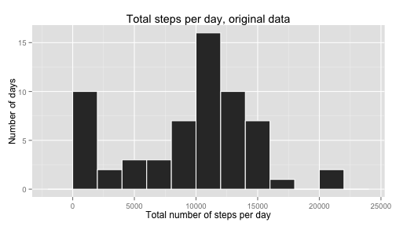
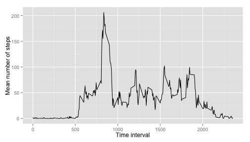
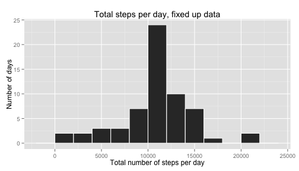
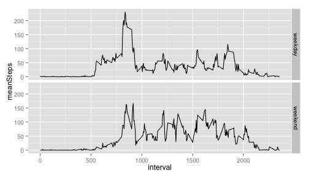

## Loading and preprocessing the data

The activity data is provided in a zipped file format. We begin by unzipping it
and reading the csv file contained inside into a data frame.


```r
unzip("activity.zip")
rawData <- read.csv("activity.csv")
```


## What is mean total number of steps taken per day?

We're going to be using the *dplyr* package for a lot of our data frame 
manipulation, so we load that. We'll also be plotting with ggplot2.


```r
library(dplyr)
library(ggplot2)
```

We proceed by grouping our data by date, using  dplyr's *group_by()* function, 
and summing up the total number of steps per day.


```r
groupedByDate <- group_by(rawData, date)
totalStepsByDate <- summarize(groupedByDate, steps = sum(steps, na.rm=TRUE))
```

Next up, we plot a histogram showing the frequency at which each daily total
number of steps appears.


```r
ggplot(totalStepsByDate, aes(x=steps)) + geom_bar(binwidth=2000, color="white") +
    xlab("Total number of steps per day") + ylab("Number of days") + 
    ggtitle("Total steps per day, original data")
```

 

Lastly we inspect the mean and median values of the daily step totals.


```r
mean(totalStepsByDate$steps)
```

```
## [1] 9354.23
```

```r
median(totalStepsByDate$steps)
```

```
## [1] 10395
```


## What is the average daily activity pattern?

In the next step, we want to study behaviour across the intervals of a day. We
again create a grouped data frame, but now group the raw data by interval. We
then use *summarize()* to create a data frame holding the mean number of steps
in each time interval, across all days in the data set.


```r
groupedByInt <- group_by(rawData, interval)
meanStepsByInt <- summarize(groupedByInt, meanSteps = mean(steps, na.rm=TRUE))
```

Let's look at a simple line plot of the results.


```r
ggplot(meanStepsByInt, aes(x=interval, y=meanSteps)) + geom_line() +
    xlab("Time interval") + ylab("Mean number of steps")
```

 

In order to obtain the interval with the highest mean steps, we first locate the
relevant row in the data frame, and then print out the corresponding interval.


```r
maxMeanStepsIndex <- which.max(meanStepsByInt$meanSteps)
meanStepsByInt$interval[maxMeanStepsIndex]
```

```
## [1] 835
```

The mean number of steps is highest in the 835 (08:35) interval.


## Imputing missing values

Finally it's time to do something about our many ugly "NA" values in the
original input data. We'll start by using the *ave()* function to create a
vector with its elements corresponding to a row in the raw data. The values of 
this vector are the mean number of steps (across all days) for the time interval
that row corresponds to. 


```r
reserveData <- with(rawData, ave(steps, interval, FUN = function(x) { mean(x, na.rm=TRUE) }))
```

The name of the vector we just created, *reserveData* implies its use. We will 
use its values to plug into the steps column of every row in the original data,
where that row is originally an "NA". Note that for this to work its crucial
that the vectors on both sides of the operation are of equal length, and that
they both use the same subsetting. We'll store results into a different data
frame, so as not to pollute the original one, should we wish to compare to it
later on.


```r
stepData <- rawData
stepData$steps[is.na(rawData$steps)] <- reserveData[is.na(rawData$steps)]
```

We'll now repeat the operations we did earlier to examine the total number of 
steps taken each day, only with our fixed up and hopefully more complete data
frame.


```r
groupedByDate <- group_by(stepData, date)
totalStepsByDate <- summarize(groupedByDate, steps = sum(steps, na.rm=TRUE))
```

Naturally we'll want to see a histogram as well.


```r
ggplot(totalStepsByDate, aes(x=steps)) + geom_bar(binwidth=2000, color="white") +
    xlab("Total number of steps per day") + ylab("Number of days") + 
    ggtitle("Total steps per day, fixed up data")
```

 

Finally we look at the mean and median values of the total number of steps,
summed up on a daily basis.


```r
mean(totalStepsByDate$steps)
```

```
## [1] 10766.19
```

```r
median(totalStepsByDate$steps)
```

```
## [1] 10766.19
```

The mean and median have both increased as a result of our imputing "reserve"
values in place of the original "NA":s. Curiously they are also identical to one
another. This is a result of the method we chose to impute missing values; had
we for example imputed medians instead of means, this would not have been the
case.


## Are there differences in activity patterns between weekdays and weekends?

In the final part of this project we will look at how weekday data compares to
that of weekends. We start by adding a new column to our (fixed up) data frame, *dayType* , which will be a factor variable containing one of two levels: 
"weekday" or "weekend". To achieve this we combine the use of dplyr's *mutate()*
function to add the column, *weekdays()* from the R base to characterize dates,
and some conditional element selection to set our new parameter appropriately.


```r
stepData <- mutate(stepData, dayType = 
                  as.factor(ifelse(weekdays(as.Date(stepData$date), abbr=TRUE) %in% c("Sat", "Sun"), "weekend", "weekday")))
```

The process of calculating mean steps per time interval is analogous to what we
did above, only in this context we will split the data frame into weekdays and
weekends before applying it. First, we grab the weekdays, group by interval, 
and summarize their mean values by interval.


```r
weekdays <- filter(stepData, dayType == "weekday")
weekdays <- group_by(weekdays, interval)
avgWeekday <- summarize(weekdays, meanSteps = mean(steps, na.rm=T))
```

Then, we do exactly the same thing for weekends.


```r
weekends <- filter(stepData, dayType == "weekend")
weekends <- group_by(weekends, interval)
avgWeekend <- summarize(weekends, meanSteps = mean(steps, na.rm=T))
```

We'll add back a column to classify weekdays and weekends respectively, which is
trivial since they are now in separate data frames. 


```r
avgWeekday <- mutate(avgWeekday, dayType="weekday")
avgWeekend <- mutate(avgWeekend, dayType="weekend")
```

When all that's done, we *rbind()* both separate frames together into one again.
This is a tidy data frame, ready for plotting and other forms of heart-warming
analysis.


```r
avgDay <- rbind(avgWeekday, avgWeekend)
```

Lastly, we draw a multi-panel line plot, showing how the mean steps per interval
change over the course of an average weekday, and day on a weekend, respectively.


```r
ggplot(avgDay, aes(x=interval, y=meanSteps)) + geom_line() + facet_grid(dayType ~ .)
```

 

Notably, people sleep in!
